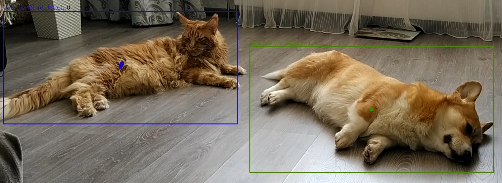
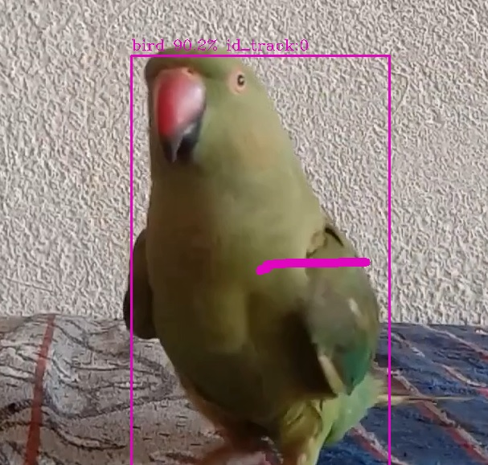

# CV-PET-TRACKER

## Глубокие модели для детектирования объектов

В настоящее время распространение получило несколько групп глубоких моделей, которые применяются для решения задачи детектирования объектов:

- `Region-based Convolutional Networks (RCNN)`
- `Region-Based Fully Convolutional Networks (RFCN)`
- `Single Shot MultiBox Detector (SSD)`
- `You Only Look Once (YOLO)`

## Cемейство моделей SSD

В Open Model Zoo присутствует семейство моделей SSD: ssd300, ssd512, mobilenet-ssd и другие. В ходе разработки были использованы модели:

- `ssdlite_mobilenet_v2`
- `ssd_mobilenet_v1_coco`
- `ssd_mobilenet_v2_coco`

Указанная группа моделей имеет идентичный вход и выход. Вход SSD моделей, обученных в TensorFlow, представляет собой тензор размера [B x H x W x C], где B - количество 
обрабатываемых изображений в пачке, подаваемой на вход сети, Н,W - высота и ширина входного изображения, C - количество каналов изображений. Выход SSD-моделей, сконвертированных 
в промежуточное представление OpenVINO, представляет собой тензор размера [1 x 1 x N x 7], в котором каждая строка (последняя размерность тензора) содержит следующие параметры:

- `image_id` - номер изображения
- `label` - предсказанный идентификатор класса в диапазоне [1, 91], сопоставленный с именами классов, указанными в `coco_91cl_bkgr.txt`
- `conf` - достоверность присутствия объекта в выделенной области
- (`x_min`, `y_min`) - координаты верхнего левого угла ограничительной рамки (координаты в нормализованном формате, в диапазоне [0, 1])
- (`x_max`, `y_max`) - координаты нижнего правого угла ограничительной рамки (координаты в нормализованном формате, в диапазоне [0, 1])

## Model API

В данном проекте мы используем готовое Model API для object detection моделей. В качестве наиболее полезных вещей для широкого круга пользователей из Model API можно выделить:

- `Возможность использовать единую функцию для открытия изображения 1 изображения, папки изображений, видео с возможностью зацикливания получения данных`
- `Возможность легкого создания асинхронного конвейера обработки данных`
- `Возможность использования готового препроцессинга и постпроцессинда данных для моделей из OpenModelZoo`

Выходом Model API для Object Detection моделей является список объект Detection, который содержит следующие параметры: [left, bottom, right, top, score, id], где id – номер
класса; score – достоверность присутствия объекта в данном месте; left, bottom, right, top – нормированные координаты окаймляющих прямоугольников. Для обработки выхода 
реализован метод draw_detection, который отрисует на изображении обнаруженные объекты.

## Пример работы








## Как работает программа
При запуске программы считываются параметры командной строки, происходит загрузка модели и входного изображения в Inference Engine.

## Запуск
Запустите программу с параметром `-h` или `--help`, чтобы увидеть сообщение о возможных вариантах запуска программы.

```
usage: pet_tracker.py [-h] -m MODEL -at {ssd,yolo,yolov4,faceboxes,centernet,ctpn,retinaface} -i INPUT [-d DEVICE]
                      [--labels LABELS] [-t PROB_THRESHOLD] [--keep_aspect_ratio] [--input_size INPUT_SIZE INPUT_SIZE]
                      [-nireq NUM_INFER_REQUESTS] [-nstreams NUM_STREAMS] [-nthreads NUM_THREADS] [--loop] [-o OUTPUT]
                      [-limit OUTPUT_LIMIT] [--no_show] [-u UTILIZATION_MONITORS] [-r]

Options:
  -h, --help            Show this help message and exit.
  -m MODEL, --model MODEL
                        Required. Path to an .xml file with a trained model.
  -at {ssd,yolo,yolov4,faceboxes,centernet,ctpn,retinaface}, --architecture_type {ssd,yolo,yolov4,faceboxes,centernet,ctpn,retinaface}
                        Required. Specify model' architecture type.
  -i INPUT, --input INPUT
                        Required. An input to process. The input must be a single image, a folder of images, video
                        file or camera id.
  -d DEVICE, --device DEVICE
                        Optional. Specify the target device to infer on; CPU, GPU, FPGA, HDDL or MYRIAD is acceptable.
                        The sample will look for a suitable plugin for device specified. Default value is CPU.

Common model options:
  --labels LABELS       Optional. Labels mapping file.
  -t PROB_THRESHOLD, --prob_threshold PROB_THRESHOLD
                        Optional. Probability threshold for detections filtering.
  --keep_aspect_ratio   Optional. Keeps aspect ratio on resize.
  --input_size INPUT_SIZE INPUT_SIZE
                        Optional. The first image size used for CTPN model reshaping. Default: 600 600. Note that
                        submitted images should have the same resolution, otherwise predictions might be incorrect.

Inference options:
  -nireq NUM_INFER_REQUESTS, --num_infer_requests NUM_INFER_REQUESTS
                        Optional. Number of infer requests
  -nstreams NUM_STREAMS, --num_streams NUM_STREAMS
                        Optional. Number of streams to use for inference on the CPU or/and GPU in throughput mode (for
                        HETERO and MULTI device cases use format <device1>:<nstreams1>,<device2>:<nstreams2> or just
                        <nstreams>).
  -nthreads NUM_THREADS, --num_threads NUM_THREADS
                        Optional. Number of threads to use for inference on CPU (including HETERO cases).

Input/output options:
  --loop                Optional. Enable reading the input in a loop.
  -o OUTPUT, --output OUTPUT
                        Optional. Name of output to save.
  -limit OUTPUT_LIMIT, --output_limit OUTPUT_LIMIT
                        Optional. Number of frames to store in output. If 0 is set, all frames are stored.
  --no_show             Optional. Don't show output.
  -u UTILIZATION_MONITORS, --utilization_monitors UTILIZATION_MONITORS
                        Optional. List of monitors to show initially.

Debug options:
  -r, --raw_output_message
                        Optional. Output inference results raw values showing.
                        
                        
```
При запуске программы с пустым списком параметров появляется сообщение об ошибке.

Например, можно использовать следующие команды для запуска программы через командную строку:

```
python pet_tracker.py -i <path_to_image> ^
                       -m <path_to_model> ^
                       -at ssd ^
                       --loop
```
> **Замечание:** Данный репозиторий содержит папку `models`, где можно найти поддерживаемые приложением модели в формате IR.

## Технические характеристики

`ssdlite_mobilenet_v2`

| Metric            | Value         |
|-------------------|---------------|
| Type              | Detection     |
| GFLOPs            | 1.525         |
| MParams           | 4.475         |
| Source framework  | TensorFlow\*  |

`ssd_mobilenet_v1_coco`

| Metric            | Value         |
|-------------------|---------------|
| Type              | Detection     |
| GFLOPs            | 2.494         |
| MParams           | 6.807         |
| Source framework  | TensorFlow\*  |

`ssd_mobilenet_v2_coco`

| Metric            | Value         |
|-------------------|---------------|
| Type              | Detection     |
| GFLOPs            | 3,775         |
| MParams           | 16,818        |
| Source framework  | TensorFlow\*  |

## Точность

`ssdlite_mobilenet_v2`

| Metric         | Value   |
| -------------- | ------- |
| coco_precision | 24.2946%|

`ssd_mobilenet_v1_coco`

| Metric         | Value   |
| -------------- | ------- |
| coco_precision | 23.3212%|

`ssd_mobilenet_v2_coco`

| Metric         | Value   |
| -------------- | ------- |
| coco_precision | 24.9452%|
